# TalkCraft Workbench 使用指南

剪映式的动效编辑工作台：**多轨时间线 + 素材库 + schema 属性面板 + 实时预览 + Remotion 导出**。
skill 渲出成片后，用它做人工微调——挪一个镜头、改一句文案、换一个音效、拉长一段停留，
不用回到代码里改 tsx。89 张动效卡全部参数化，口播成片可一键拆成多轨工程逐项编辑。

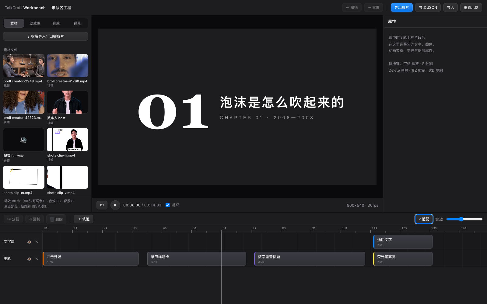

界面五个区域，从左到右、从上到下：

| # | 区域 | 干什么 |
|---|---|---|
| ① | **顶栏** | 工程名 · 撤销/重做 · 导出成片 · 导出/导入工程 JSON · 重置示例 |
| ② | **素材库**（左） | 四个 tab：素材 / 动效库 / 音效 / 背景；点击预览，拖到时间轨添加 |
| ③ | **预览区 + 播控条**（中） | Remotion Player 实时预览；回到开头 / 播放 / 时间码 / 循环 |
| ④ | **属性面板**（右） | 选中片段后：内容与样式（schema 控件）/ 时间与变速 / 图层 |
| ⑤ | **时间轨**（下） | 多轨、标尺、播放头；分割 / 复制 / 删除 / 加轨 / 缩放；片段拖动、两端裁剪、跨轨移动 |

三条分隔线都能拖：素材库宽度、属性面板宽度、时间轨高度，尺寸记在浏览器里。

## 启动

```bash
cd workbench
npm install          # 首次；prepare 钩子会生成素材清单与索引
npm run dev          # http://localhost:5199
```

不接任何外部工程也能跑：自带一个 14 秒的演示工程（上图），89 张动效卡全部可用。
要编辑 skill 渲出的**口播成片**，先按 [README「接入口播成片工程」](README.md#接入口播成片工程可选)
把工程的 `src/` 和 `public/` 链接进来，素材库里就会出现实拍素材、数字人、配音，以及「拆解导入」按钮。

## ① 顶栏

- **工程名**：直接点击编辑，导出的 MP4 / JSON 以它命名。
- **↩ 撤销 / ↪ 重做**（⌘Z / ⇧⌘Z）：所有编辑动作都进撤销栈，包括拆解导入、重置示例、隐藏轨道；
  属性面板里 0.8 秒内的连续拖动合并为一步。
- **导出成片**：把当前工程交给 dev server 里的 Remotion CLI 渲成 MP4（详见下文「⑦ 导出成片」）。
  渲染中按钮显示进度，完成后变成「✓ 已导出 · 显示文件」，点它在 Finder 里定位文件。

  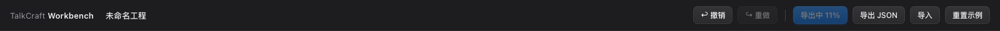
  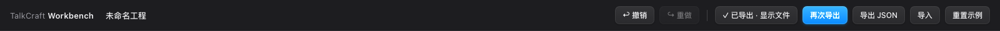

- **导出 JSON / 导入**：工程本体就是一份 JSON（轨道、片段、每个片段的参数），可以存档、发给别人、或改完再导回。
- **重置示例**：回到演示工程（会确认，可撤销）。

工程还会**自动保存**到浏览器 localStorage（改动后 0.8 秒落盘，关页 / 切后台立即落盘），刷新不丢。

## ② 素材库

四个 tab，任何条目都是**点击预览、拖到时间轨添加**。底部一行是库存统计。

### 素材

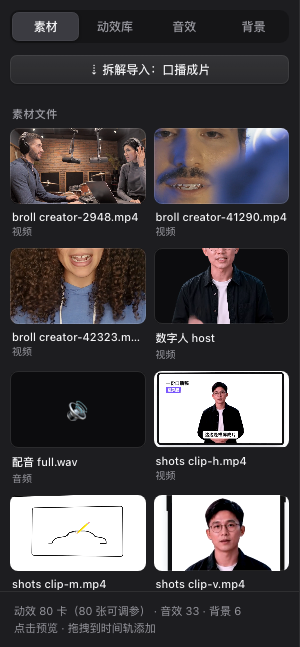

- **⇣ 拆解导入：口播成片**——一键把接入的口播成片拆成多轨工程（见下文「⑥ 口播成片拆解」）。
- **素材文件**：接入工程 `public/` 下的实拍视频、图片、配音（按目录扫描生成，换工程自动更新）。
  网格里的视频缩略图循环播放；拖到时间轨分别成为视频 / 图片 / 音频片段。
- **口播成片 · 拆解单元**：字幕行、转场、环境层、数字人等口播专用卡，可以单独再加一份。

点击任何素材，预览区切到「素材预览」，原尺寸播放；「✕ 返回工程」回到工程预览。

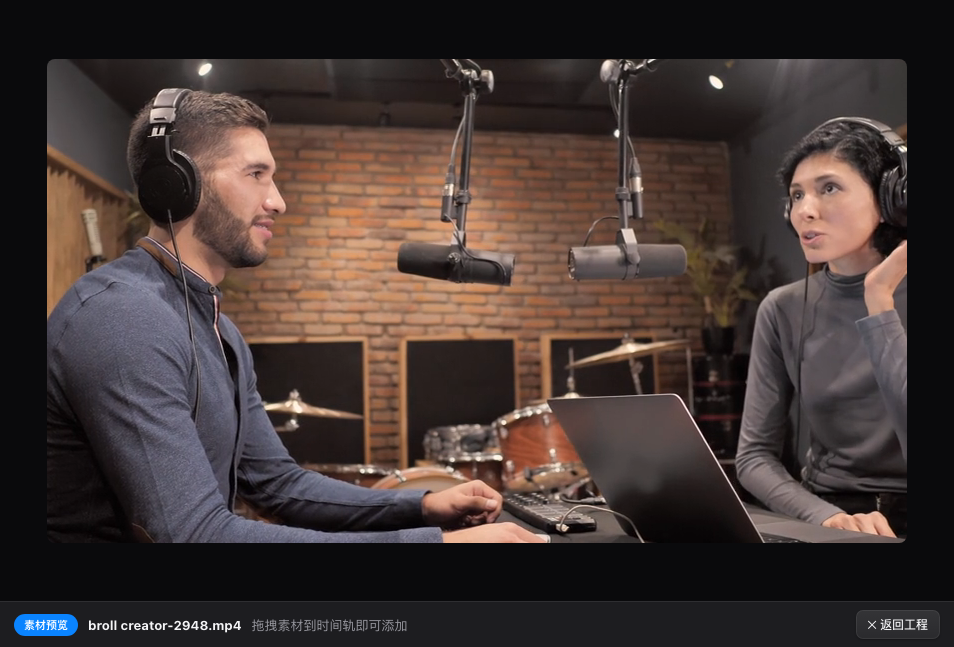

### 动效库

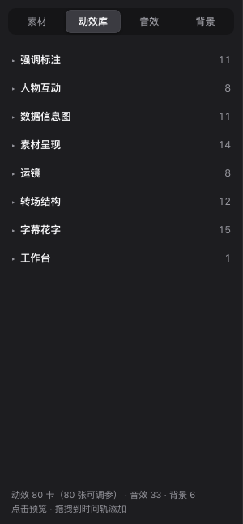
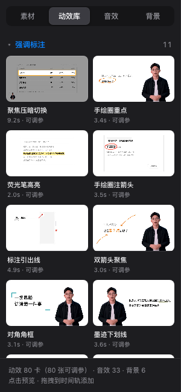

89 张动效配方卡按[在线画廊](https://vincentwei1021.github.io/video-talkcraft/)的 7 个分类折叠：
强调标注 / 人物互动 / 数据信息图 / 素材呈现 / 运镜 / 转场结构 / 字幕花字（另有「工作台」自有卡）。
每张卡显示时长，「· 可调参」表示它有属性面板可调的参数——现在 89 张全部可调。
缩略图是画廊的预览视频，没有预览视频的卡用 Player 实时循环。

### 音效

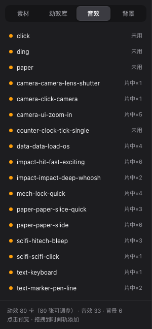

接入工程 `public/sfx/` 下的全部音效（当前 33 个），右侧「片中×N」是它在口播成片里的使用次数，
「未用」是还没用过的。拖到时间轨成为音频片段，音量在属性面板里调。

### 背景

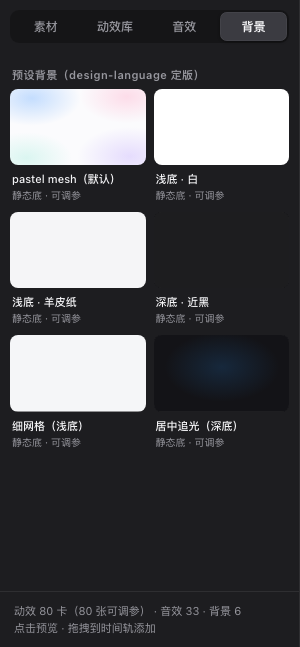

`references/design-language.md` §1.1 定版的 6 款静态幕底：pastel mesh（skill 默认）、浅底白、羊皮纸、
深底近黑、细网格、居中追光。放在最下面一条轨道上铺满全片即可。

## ③ 预览区与播控条

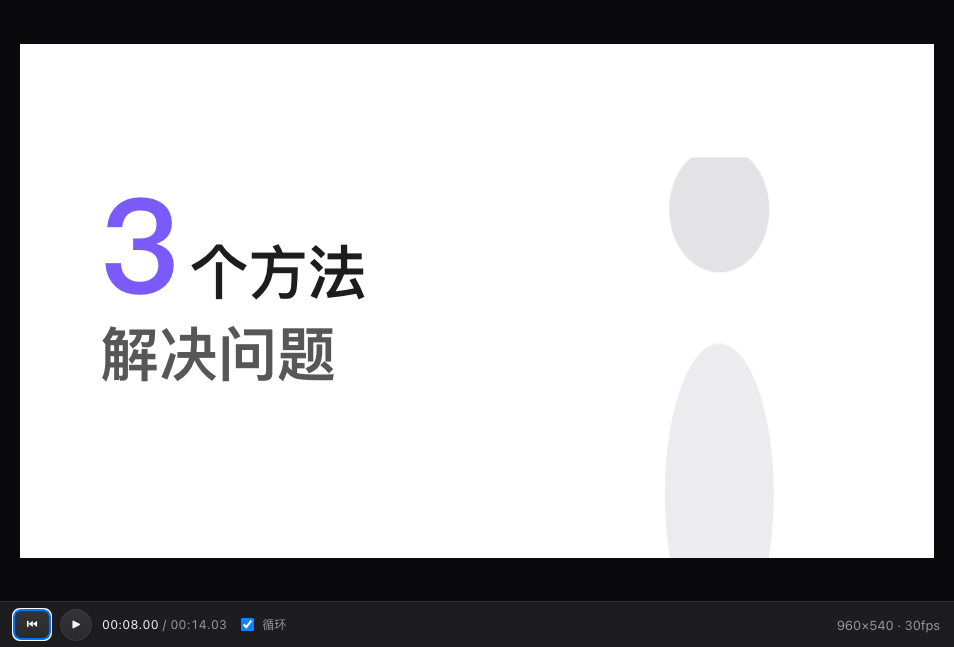

- 预览用 `@remotion/player` 实时渲染，所见即导出所得（同一套 Remotion 合成）。
- **⏮** 回到开头 · **▶ / ⏸** 播放暂停（空格）· **时间码** 当前位置 / 工程总长 · **循环** 到尾自动回头。
- 右侧显示合成尺寸与帧率（默认 960×540 · 30fps；拆解导入的口播工程沿用原片参数）。
- **← / →** 步进 1 帧，**Shift + ← / →** 步进 10 帧，播放头与时间轨同步。

## ④ 属性面板

选中时间轨上的片段后出现。标题是卡名和所在轨道。

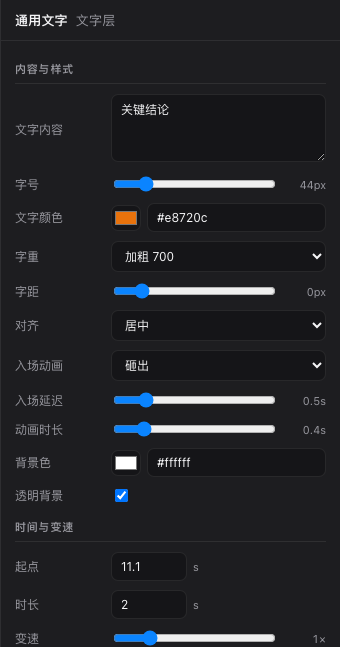
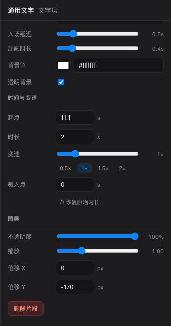

**内容与样式**——由卡片的 schema 自动生成控件：

| 控件 | 用途 | 例子 |
|---|---|---|
| 文本 / 多行文本 | 文案；多条内容用**逐行 DSL**（一行一条） | 通用文字的「文字内容」、简介、tab 标签 |
| 数字 / 滑杆 | 字号、位置 posX/posY、起手静置、光标起手等 | 字号 44px、入场延迟 0.5s |
| 颜色 | 强调色、文字色、背景色 | `#e8720c` |
| 下拉 | 枚举：字重、对齐、入场动画方式 | 加粗 700 · 居中 · 砸出 |
| 开关 | 布尔：透明背景、认证标、顶部导航 | 透明背景 ☑ |

参数化的原则：卡片 CONFIG 里的**语境级**参数（文案 / 颜色 / 字号 / 位置 / 起手静置）开放，
决定动效品相的**节奏命门**（弹入时长、错峰间隔、缓动曲线）保持固定不暴露——所以怎么调都不会把卡调坏。
产品界面类卡（X / 抖音关注卡、ChatGPT、Claude Code）连颜色也不开放：产品皮就是内容本身。

**时间与变速**：

- **起点**（秒）· **时长**（秒）· **变速**（0.25×–4× 滑杆，另有 0.5 / 1 / 1.5 / 2 预设）· **裁入点**：从卡片素材的第几秒开始播，控制动效进场时机。
- 「时长恢复」按当前变速换算回卡片原始时长。
- 片段比卡片原始时长**更长**时，动效走完后自动尾帧定格（Freeze），不会黑屏或跳回。

**图层**：不透明度 · 缩放 · 位移 X / Y——整个片段作为一层做变换，叠在下层轨道之上。

## ⑤ 时间轨

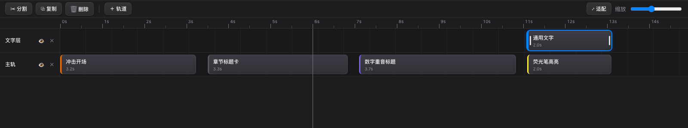

- **工具条**：✂ 分割（S，在播放头处）· ⧉ 复制（⌘D，接在原片段后）· 🗑 删除（Delete）·
  ＋ 轨道（加在最上层）· ⤢ 适配（缩放到全部内容可见）· 缩放滑杆。
- **轨道头**：名称 · 👁 显示 / 隐藏该轨 · × 删除该轨（都可撤销）。上面的轨道盖住下面的轨道。
  **按住轨道头上下拖动**可调整轨道层序：蓝线标出落点，松手生效（一步撤销）。
- **片段**：拖动改起点；拖两端裁剪时长；拖到别的轨道换轨；点选后高亮，属性面板同步。
  左侧色条是卡片的类别色签，标签显示卡名（或你改过的文案摘要）与时长。
- **播放头**：竖线随播放移动，也可用 ← / → 步进定位；分割以它为刀口。
- 从素材库拖入新片段时，以放下的位置为起点、落在哪条轨就加到哪条轨（点击条目只是预览，不会添加）。

## ⑥ 口播成片拆解

需要先接入口播成片工程。点素材 tab 顶部的「⇣ 拆解导入：口播成片」，原片被拆成七类独立单元，
每一项都成了可以单独挪动、改参数、删掉的片段：

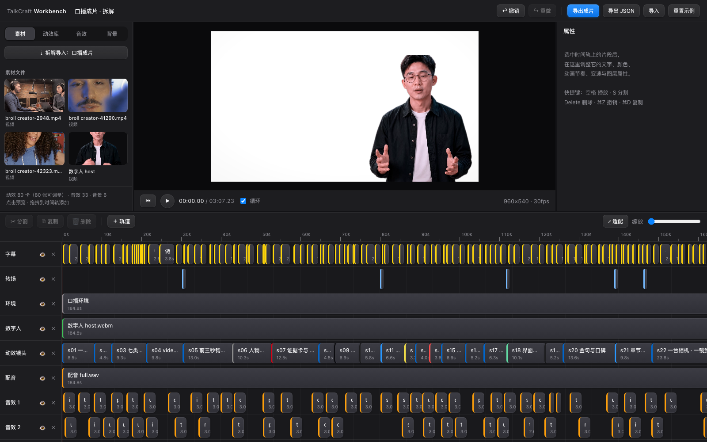
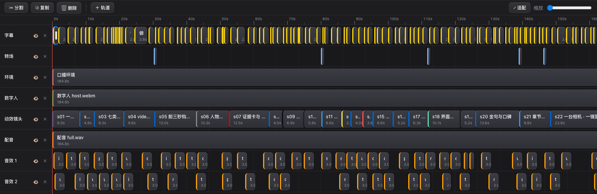

| 轨道 | 内容 | 可以改什么 |
|---|---|---|
| 字幕 | 一句一个片段（原片 127 句） | 文本、深浅色、半屏让位 |
| 转场 | 每次三色扫一个片段，时刻取自工程的换幕表 | 位置、时长 |
| 环境 | 呼吸环境层，铺满全片 | 开关（隐藏轨道） |
| 数字人 | host 视频，铺满全片 | 裁入点、图层变换 |
| 动效镜头 | 一镜一个参数化卡（kscene-sNN，原片 23 镜） | 文案、颜色、字号、位置（词锚节拍与相机固定） |
| 配音 | 整条 full.wav | 音量 |
| 音效 | 一 cue 一个片段（原片 81 条），自动装箱进若干条互不重叠的轨 | 挪位置、改音量、删掉 |

相邻镜头之间的 8 帧重叠是原片的交叠转场设计，不是错位，别去对齐。
换幕时刻、素材清单、音效列表都是按接入工程生成的（`npm run gen` 或任何一次 `npm run dev` 都会重扫），
换一个口播工程不需要改代码。整个导入是一步撤销操作。

## ⑦ 导出成片

顶栏「导出成片」→ dev server 起 Remotion CLI 渲染当前工程：

1. 把 `public/` 解引用同步到 `.render-public/`（Remotion 静态服务器拒绝服务符号链接，而本机素材全是符号链接）；
2. 用当前工程 JSON 作为 inputProps，`renderExact: true` 取内容精确时长（预览时留的 1 秒余量不进成片）；
3. `--concurrency=1` 单并发渲染——多 tab 并发的光栅相位不一致会让静态文字"随音乐抖"；
4. 输出到 `workbench/exports/<工程名>-<时间>.mp4`，完成后一键在 Finder 显示。

要更快的迭代，也可以用 skill 的分段渲染母版制直接渲工作台工程（改一镜只重渲一段）：

```bash
cd workbench
node ../scripts/render_shots.mjs --shots shots.json --entry src/remotion/index.ts --comp Main \
     --props @project.json --public-dir .render-public --all --parallel 4 \
     --concat out/assembled.mp4 --audio out/full-mix.wav --mux out/preview.mp4
```

## 快捷键

| 键 | 动作 |
|---|---|
| 空格 | 播放 / 暂停 |
| S | 在播放头处分割选中片段 |
| Delete / Backspace | 删除选中片段 |
| ⌘D | 复制选中片段 |
| ⌘Z / ⇧⌘Z | 撤销 / 重做 |
| ← / →（+Shift） | 播放头步进 1 帧（10 帧） |

## 文档截图

本文的图由 `scripts/screenshots.mjs` 对运行中的 dev server 自动截取（独立浏览器上下文，不碰你的工程状态）：

```bash
npm run dev                                   # 另一个终端
node scripts/screenshots.mjs                  # 默认 http://localhost:5199 → docs/img/
node scripts/screenshots.mjs --no-export      # 跳过"导出成片"两张（那两张会真的渲一遍演示工程）
```
